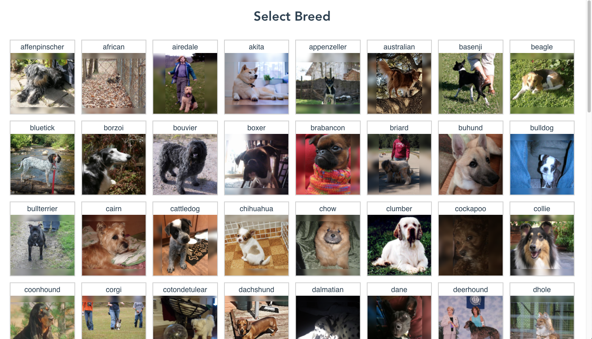
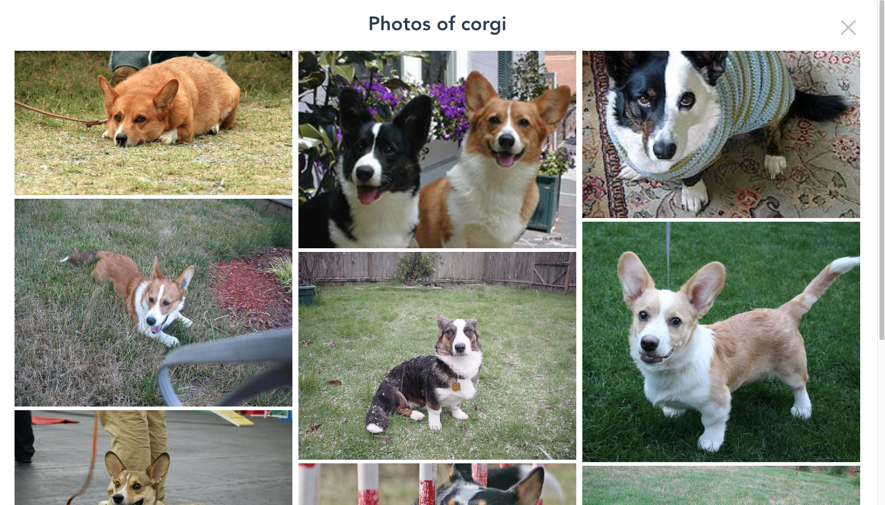

# Doggies

Dog breed selector by photo. Built on [Dog API](https://dog.ceo/dog-api/) using Vue.js.

Can be viewed at: [https://vsapronova.github.io/Doggies/](https://vsapronova.github.io/Doggies/)

Consists of two views: Breed Selector and Photos Viewer:



## Project setup
```
yarn install
```

### Compiles and hot-reloads for development
```
yarn serve
```

### Compiles and minifies for production
```
yarn build
```

### Lints and fixes files
```
yarn lint
```

### Customize configuration
See [Configuration Reference](https://cli.vuejs.org/config/).
